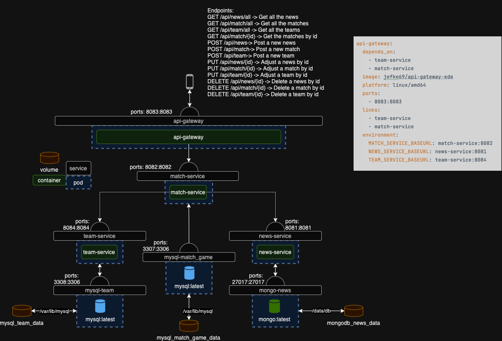

# Ede-football

In het project voor het vak advanced programming heb ik 3 microsevices gemaakt, deze communiceren met elkaar. 
Om een rode lijn door het project te krijgen heb ik gekozen voor het thema voetbal. Ik heb hier 3 microservices rond gemaakt
- match-service: voor alle matchen te bekijken, die al gebeurd zijn of die gepland zijn
- team-service: alle teams die bestaan in voetbal
- news-service: ben je up to date met alle nieuwtjes in de voetbalwereld 

Ik heb ook nog een api-gateway om ervoor te zorgen dat alles via 1 poort verloopt, is veel makkelijker om zo ook authenticatie toe te passen

## Scheme in draw.io
Hieronder kan je mijn schema zien. Je kan zien dat de match-service data haalt uit de andere 2 microservices. 
Wat ook logisch is want voor een match heb je teams nodig en zo kan je bestaande teams toewijzen aan een match.

## Alle endpoints die je in postman kunt doen: 
- GET /api/news/all -> Get all the news
- GET /api/match/all -> Get all the matches
- GET /api/team/all -> Get all the teams
- GET /api/match/{id} -> Get the matches by id
- POST /api/news-> Post a new news
- POST /api/match-> Post a new match
- POST /api/team-> Post a new team
- PUT /api/news/{id} -> Adjust a news by id
- PUT /api/match/{id} -> Adjust a match by id
- PUT /api/team/{id} -> Adjust a team by id
- DELETE /api/news/{id} -> Delete a news by id
- DELETE /api/match/{id} -> Delete a match by id
- DELETE /api/team/{id} -> Delete a team by id

Je kan alleen de get verzoeken bereiken zonder ingelogt te zijn, voor de andere moet je ingelogt zijn.